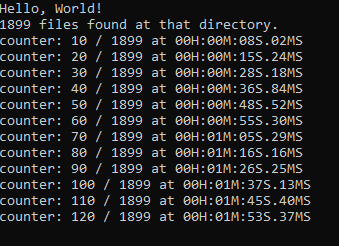

# HEIC to JPEG Converter
Written in C# .Net as a console applocation. 
This project utilized the [ImageMagick.Net](https://github.com/dlemstra/Magick.NET) library for image conversion. 

Prompts the user for an input directory and searches the directory and all subdirectories for the .heic files and converts them to .jpeg. 

## Optimizations:
1st version seemed like it could use some improvements as completeing 10 files in 8 seconds or more seemed unacceptable. 

2nd/improved version had a 2 second improvement. This was achieve by:
* File I/O: Minimize string manipulations overhead
* Logging: Limited logging to only display at 10 files
  

